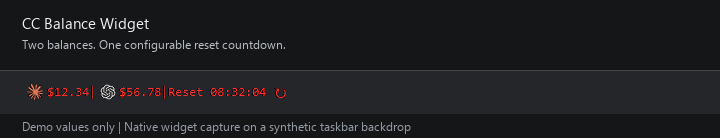
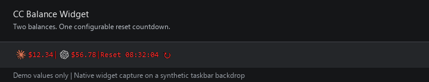

<div align="center">

# CC Balance Widget

**把 CC Switch 中 Claude / Codex 的剩余 USD 放到桌面上。**


[English](README.en.md) · [快速开始](#快速开始) · [验收清单](docs/manual-acceptance.md)



</div>

一个小而安静的 Windows 余额条：两个图标、两个余额、一个每日重置倒计时。
这是独立项目，**不是 CC Switch、Anthropic 或 OpenAI 的官方组件**。
当前为 `v0.1.0-beta.1` 候选源码；发布状态与已验证限制见[验收记录](docs/verification.md)。

> **Provider 可以更换：**在悬浮条上右键，选择 **数据源设置**，即可分别选择
> Claude 和 Codex 使用的 CC Switch Provider。该功能不是绑定 `OpenRouter ICU`；
> 它只是首次打开时的默认候选名称。



图片与动图来自隔离演示模式，金额为虚构值，不代表真实账户。

## 功能

- Claude / Codex 使用 16×16 图标，悬停显示名称；单行显示，不含 Token 或历史统计。
- 启动即查，每 10 分钟自动刷新；右侧按钮和右键菜单可立即刷新。
- 查询期间显示省略号，不阻塞拖动或倒计时；每项失败独立保留上次成功值。
- 透明外观、可拖动、记住位置、数字颜色设置、可选开机自启。
- 右键选择数据库和两个 Provider，不绑定单一供应商。
- 默认北京时间每日 00:00 重置倒计时，也可以自行设置时间。

## 快速开始

### 1. 准备环境

- Windows 桌面会话。
- Python **3.12+**，安装时包含 Tcl/Tk。验证基线为 Python 3.12。
- Node.js **22+**，正常查询需要 `node` 可用。验证基线为 Node 22。
- CC Switch 中已配置可信的 JavaScript usage 查询脚本。

运行时不需要第三方 Python 包。PNG 图标和 JavaScript 执行器随源码提供。

### 2. 下载源码后运行

在项目目录打开 PowerShell：

```powershell
# 演示：不读数据库、不联网、不修改个人设置或启动项
.\Start.ps1 -Demo

# 正常运行：无命令行窗口
.\Start.ps1

# 诊断真实查询：会联网，不打印密钥
.\Start.ps1 -Check
```

启动器优先使用项目 `.venv`，否则探测已安装的 Python，并检查依赖。
如果系统策略禁止运行 PowerShell 脚本，不必更改全局策略，可以直接运行：

```powershell
python run.py --demo
python run.py
```

开发者也可执行 `python -m pip install -e .`，然后使用
`python -m cc_balance_widget --demo`。
项目暂不提供 EXE 或安装器。

### 3. 选择数据源

右键悬浮条 → **数据源设置**：

1. 选择 CC Switch 数据库，默认 `%USERPROFILE%\.cc-switch\cc-switch.db`。
2. 点击“读取列表”，分别选择 Claude 页和 Codex 页的 Provider。
3. 保存后立即查询。默认尝试选择各页名称准确为 `OpenRouter ICU` 的唯一 Provider。

配置保存的是 **Provider ID + 应用类型**。同名 Provider 不会按列表顺序猜选。
更换数据库或 Provider 时切换到对应的缓存，没有缓存就显示 `$--`。

## 操作

| 操作 | 行为 |
|---|---|
| 拖动文字、图标或字间空白 | 移动窗口，松开后保存位置 |
| 点击右侧刷新图标及周围区域 | 查询余额，不会重置账户额度 |
| 刷新中显示 `…` | 正在等待查询；重复点击不叠加请求 |
| 右键 → 修改颜色 | 改变数字和刷新图标颜色；品牌图标颜色固定 |
| 右键 → 数据源设置 | 选择数据库，并按 Provider ID 分别绑定 Claude 与 Codex |
| 右键 → 置顶 | 显示当前开关状态；关闭后不再维护顶层 |
| 右键 → 开机自启 | 写入当前用户启动项，无需管理员权限 |
| 右键 → 查询状态 | 查看最近成功时间、脱敏查询错误和保存失败提示 |
| 右键 → 设置 Reset 时间 | 输入北京时间 `HH:MM:SS` |

创建桌面快捷方式（不会覆盖已有同名快捷方式）：

```powershell
.\scripts\Create-Shortcut.ps1
```

快捷方式仅为启动进程设置 `ExecutionPolicy Bypass`，不修改用户或系统执行策略；
依赖检测失败时会弹出错误提示。企业组策略仍可能禁止脚本执行。

## 数据与隐私

只读 CC Switch 的 `providers` 表，复用选中记录中的
`meta.usage_script.code`、`request` 和 `extractor`。没有重新实现供应商 API。
CC Switch 窗口不需要保持开启，但其数据库必须可读取。

兼容脚本须满足：

- 已启用的 JavaScript usage 脚本。
- 请求为 **HTTPS、同源 GET**；拒绝跳转、跨域及写入请求。
- 提取结果为一个对象，或只含一个对象的数组；必须明确包含有限数字
  `remaining` 和 `unit: "USD"`。
- 不支持 OAuth 订阅额度、多个套餐汇总或需要登录浏览器的查询流程。

**只运行你信任的本地脚本。Node VM 不是恶意代码安全沙箱。**
密钥只在内存和子进程标准输入中传递，不写入命令行参数、设置或日志。
网络访问是脚本指定的余额查询；本工具不增加遥测。

本地设置和最近成功余额位于 `%LOCALAPPDATA%\CCBalanceWidget\state.json`，
包含数据库路径、Provider ID、窗口配置和按数据源隔离的余额缓存，**不含密钥**。
这不是加密存储；分享日志或配置前仍需检查个人信息。
默认原子替换保存；文件系统跨卷重定向时回退为复制，回退不保证原子性。

启动项为
`HKCU\Software\Microsoft\Windows\CurrentVersion\Run\CCSwitchBalanceWidget`。
移走源码后重新设置自启；卸载前关闭自启，再退出、删除项目与设置目录。
旧版个人原型的设置不自动导入，避免错误绑定账户。

## Reset 不等于服务商承诺

倒计时是用户配置的每日时刻，默认 **北京时间 UTC+8 00:00**。
它不表示 CC Switch 或供应商已确认的实际重置时间，也不会自动增加余额。
供应商时刻不同，请手动修改。计算不受电脑当前时区影响。

## 限制与排错

- “置顶”每 500 毫秒恢复窗口层级，不提升权限，也不保证覆盖开始菜单、
  UAC 安全桌面、全屏程序或所有系统界面。不得把它当作系统级任务栏插件。
- 鼠标接收层不透明度为 1/255，外观近乎透明，但窗口范围不会穿透点击。
- Windows DPI、不同任务栏设置和多显示器组合需要单独验收，不能从单机成功推断全面支持。
- `$--`：检查数据源、usage 脚本和依赖；不是余额为零。
- 余额未变化：查看“查询状态”，失败会保留旧值；余额本身也可能没有变化。
- 查询失败：核对 CC Switch 中同一 Provider 的脚本是否可用，以及是否符合上述限制。
- 数据库被锁或结构不兼容：关闭占用后重试；工具不会创建、修改或迁移 CC Switch 数据库。
- 请勿把真实密钥、数据库或未脱敏设置上传到 Issue。

## 测试与贡献

```powershell
python -m unittest discover -s tests -v
node --test tests/test_usage_runner.cjs
python scripts/check_public_tree.py
```

离线测试只用虚构数据库和响应；Windows CI 不接触真实账户。
真实鼠标、任务栏层级和桌面 DPI 是[单独的验收项目](docs/manual-acceptance.md)，
不是模拟事件测试的替代品。

详见 [CONTRIBUTING](CONTRIBUTING.md)、[安全说明](SECURITY.md)、
[变更记录](CHANGELOG.md)。

## 致谢与许可

- [CC Switch](https://github.com/farion1231/cc-switch)：数据约定、图标来源。
- [CodexBar](https://github.com/steipete/CodexBar)：README 展示方式参考。
- [Claude Code Usage Monitor](https://github.com/CodeZeno/Claude-Code-Usage-Monitor)：文档组织参考。
- [TrafficMonitor](https://github.com/zhongyang219/TrafficMonitor)：中文截图与帮助风格参考。

代码采用 [MIT](LICENSE)；图标来源、第三方许可和商标归属见
[assets/NOTICE](src/cc_balance_widget/assets/NOTICE.txt)。上述项目与品牌未为本项目背书。
